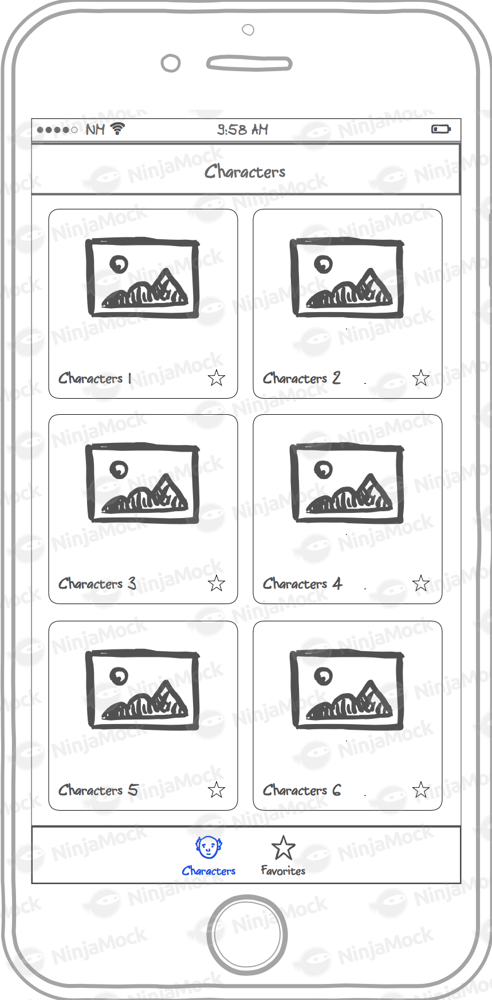
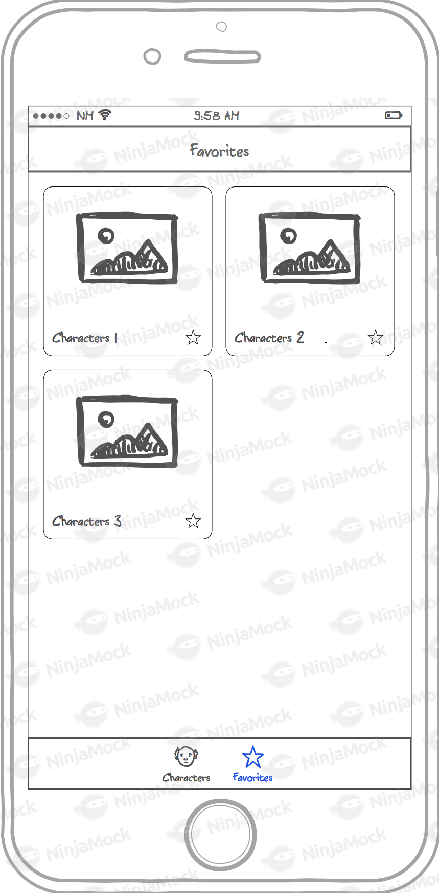
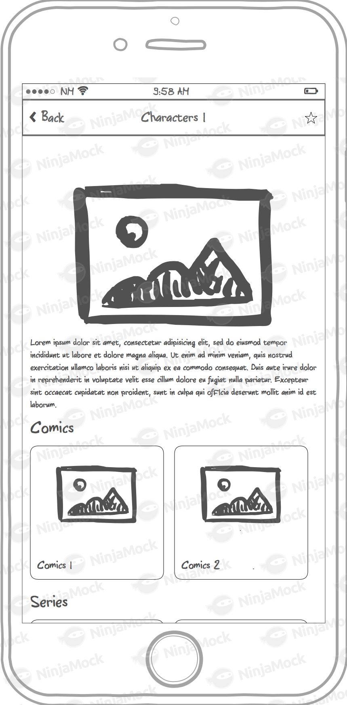

# Desafio - Desenvolvedor iOS

Nós de mobile somos fãs da Marvel :heart_eyes:, então por isso gostaríamos de um app para listar os personagens e saber mais sobre eles :rocket:.

O objetivo é implementar um app :iphone: onde podemos ver a lista de personagens da Marvel. O app deve mostrar uma lista e ser possível navegar para os detalhes de cada personagem :space_invader:. Além disso, tanto na lista quanto na tela de detalhes, deve ser possível favoritar :star: o personagem. Os personagens favoritados devem ser persistidos no device para que possam ser acessados offline e serem mostrados em uma aba própria.

## API

Para desenvolver o app :iphone: você vai precisar usar o endpoint de `"Characters"` da API Marvel. 
Mais informações: https://developer.marvel.com/docs.

## Interface

- [x] A interface do app :iphone: é dividida em **3 partes** e deve ser desenvolvida conforme os pontos abaixo.

### Home - Characters

- [x] Listagem dos personagens ordenados por ordem alfabética.
- [x] Botão para favoritar :star: personagem nas células.
- [x] Pull-to-refresh para atualizar a lista.
- [x] Altenar modo de exibição entre **grid** ou **list**.
- [x] Paginação na lista:
    - Carregar **20 personagens** :space_invader: por vez, baixando a próxima página ao chegar no fim da lista.
- [x] Interface de :warning: lista vazia, erro ou sem internet.

### Detalhes do personagem

- [x] Botão de favorito :star:.
- [x] Foto :foggy: em tamanho maior.
- [x] Nome do personagem na barra de navegação.
- [x] Descrição do personagem :space_invader: se houver, caso contrário exibir uma mensagem  *"sem descrição."* .
- [x] Lista horizontal de Comics *(se houver)*.
- [x] Lista horizontal de Series *(se houver)*.

### Favoritos

- [x] Listagem dos personagens favoritados pelo usuário.
- [x] Não há limite de personagens a serem favoritados :metal:.
- [x] Favoritos devem ser persistidos localmente para serem acessados offline.
- [x] Interface de lista vazia, :no_mobile_phones: erro ou sem internet.

### Wireframe

Abaixo :eyes: temos os wireframes das telas do app.

|   |  |  |
|:---:|:---:|:---:|
| Lista de Personagens | Favoritos | Detalhes do Personagem |

## Requisitos Essenciais

- [x] Usar Swift 4.
- [x] Interface no Storyboard usando Auto Layout.
- [x] App universal, desenvolva uma interface que se adapte a telas maiores.
- [x] Tratamento para :no_mobile_phones: falha de conexão.
- [x] O teste não pode apresentar crash :boom:.
- [x] Testes unitários.
- [x] Widget com os 3 primeiros personagens com ação de abrir o app no detalhe do personagem.

## Bônus

- [ ] **Barra de busca** para filtrar lista de pesonagens por nome.
- [ ] Testes de interface :+1:.
- [ ] Integração com fastlane para cobertura de testes.

## Observações

- [x] Você pode :point_up: utilizar bibliotecas de terceiros e gerenciadores de dependências (CocoaPods, Carthage, etc) como preferir.
- [x] Foque o desenvolvimento nos requisitos essenciais. O bônus vai diferenciar você dos outros candidatos, mas **os requisitos essenciais são mais importantes**.
